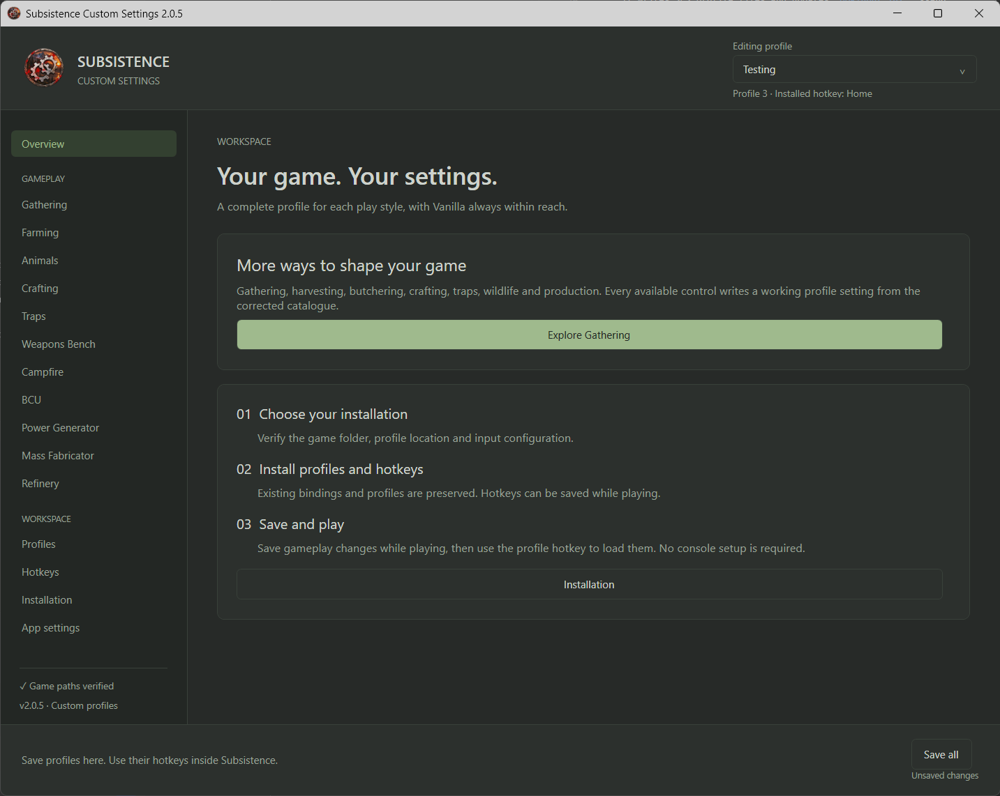
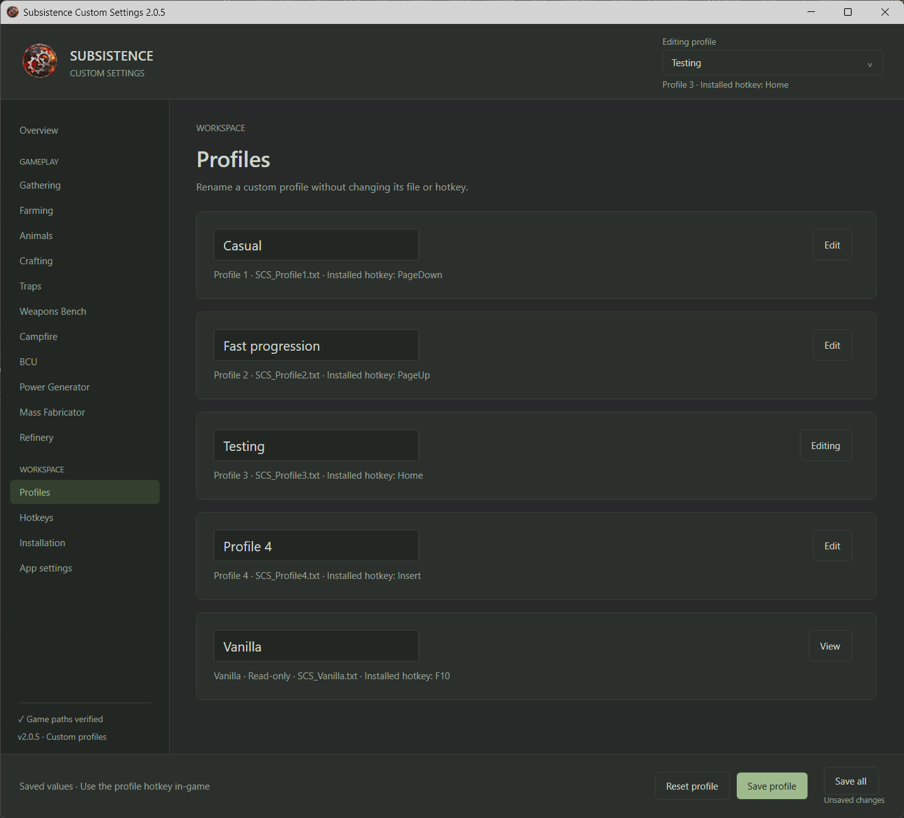
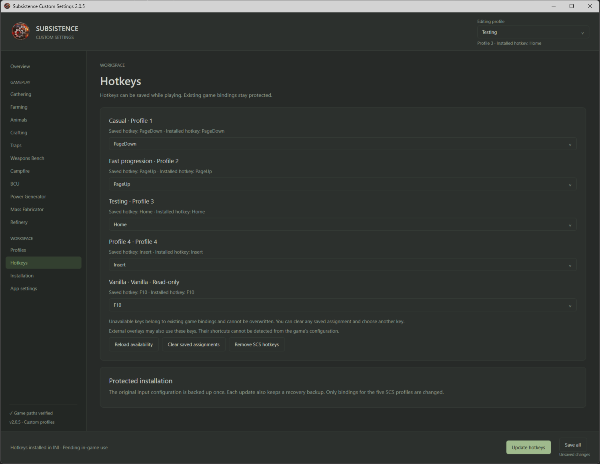

# Subsistence Custom Settings

A Windows companion application for configuring Subsistence gameplay profiles and hotkeys.

**Version 2.0.5 · Windows x64 · C# / WPF / .NET 9**

This project is open source and licensed under the [MIT License](LICENSE.md).
The source code is publicly available for transparency, security review, learning, and community contributions.

## Download and use

Download the Windows executable from [Releases](https://github.com/Airam-7/Subsistence-Custom-Settings/releases). The self-contained application includes its .NET runtime; no separate runtime installation is required.

1. Run the application and locate your Subsistence installation.
2. Verify the game paths and install missing profiles.
3. Choose unused hotkeys and use **Install hotkeys** to update the game's input configuration.
4. Edit a profile, save it, and press its installed hotkey in-game.

The application configures 20 settings and generates 154 commands per complete profile using catalog 2.0.1. Four custom profiles have stable filenames, and a read-only Vanilla profile restores the known catalog baselines. See [the catalog](CATALOG.md) and [Spanish user guide](docs/USER_GUIDE.es.md).

**Save profile** saves only the active profile. **Save all** saves pending profiles and local preferences, including hotkey assignments; it does not install hotkeys. **Install hotkeys** validates assignments and updates `UDKInput.ini`. A saved assignment and an installed binding are distinct states.

Profiles can be saved while the game is running. Hotkey edits are also allowed, with backups and concurrent-change checks. INI writes use the existing normal player-binding table: `ColdGame.ColdPlayerInput` when it contains non-SCS bindings, otherwise `Engine.PlayerInput`.

## Screenshots

### Main interface

### Profiles and gameplay settings

### Hotkey configuration

## Requirements / Compatibility

- Windows 10 or Windows 11, 64-bit.
- Steam version of Subsistence.
- No separate .NET installation is required; the release executable is self-contained.
- The application must be able to write to the selected Subsistence installation folders.
- SCS creates and updates profile files in the game's `Binaries` folder and manages hotkey bindings through `UDKInput.ini`.
- SCS is designed to work the same whether it is obtained from Steam Workshop, Nexus Mods or GitHub Releases; runtime behavior is independent of the distribution source.
- The Windows executable is currently unsigned, so Windows SmartScreen may display a reputation warning. Do not disable security protections; verify the release source and checksum instead.

## Security / What this app does

The application has no application-level internet connection, telemetry, code injection, background service, or self-updater. It does not modify game executables during normal use or request administrator elevation. File permissions can still prevent changes to protected folders.

It writes SCS profile files and updates `UDKInput.ini`, **and also creates local preferences, backups, installation journals, and metadata**. The complete scope, safeguards, test-mode exception and review entry points are documented in [SECURITY.md](SECURITY.md). Public source is an aid to review, not a security certification.

## Build and review

See [BUILD.md](BUILD.md) for the SDK, build, test, publish and checksum commands. The release tag `2.0.5` identifies the published release. The SHA-256 of the published executable is recorded in [BUILD.md](BUILD.md) so downloads can be checked against the published artifact. Independent byte-for-byte reproducibility is not claimed.

| Location | Responsibility |
| --- | --- |
| `src/SCS.Core` | Catalog, validation, deterministic command compilation, profiles and safe file operations |
| `src/SCS.Desktop` | WPF interface, draft state, local preferences and close/save workflow |
| `src/SCS.Cli` | Headless catalog/compiler and installation utilities |
| `tests/SCS.Tests` | Executable regression tests using temporary synthetic installations |
| `examples` | Example profile and generated commands |

See [validation notes](docs/VALIDATION.md), [architecture](docs/ARCHITECTURE.md), and [Workshop description draft](docs/WORKSHOP.md).

## Reports

Use repository Issues for bugs. Include the application version and steps to reproduce, but do not post personal paths, private INI files, or credentials.

## Contributing

Bug reports, testing feedback, forks and pull requests are welcome. For larger behavioral changes, please open an issue first so the change can be discussed before implementation.

See [CONTRIBUTING.md](CONTRIBUTING.md) for contribution guidelines.

Subsistence Custom Settings is an independent community project and is not affiliated with or endorsed by the developer of Subsistence.

## License

Subsistence Custom Settings is licensed under the MIT License.

You are free to use, copy, modify, merge, publish, distribute, sublicense, and/or sell copies of the software, provided that the original copyright notice and license are preserved.

This project is licensed under the [MIT License](LICENSE.md).

Third-party names, trademarks and assets are not relicensed by the MIT License. See [NOTICE.md](NOTICE.md).
